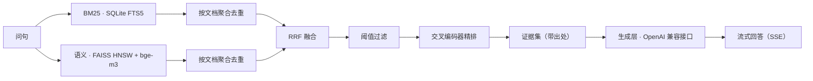

# rag-stack · 双库 RAG 问答系统

面向两套**完全隔离**的知识库（`ai4s` / `mito`）的检索问答服务：
**混合检索（BM25 + 向量）→ RRF 融合 → 交叉编码器精排 → 流式生成**，
带多轮对话、证据留存、只读文献卡查阅，以及一个**只暴露 `search`** 的 MCP 出口。

三条贯穿全局的设计取向：

1. **只依据第一手资料作答** —— 检索证据来自知识库原文；历史问答记录**不得**作为检索证据。
2. **两库严格隔离** —— 一切按 `lib` 路由：数据、索引、配置、模型缓存各归各库，互不混用。
3. **对外服务侧只读** —— 部署侧是本机数据的**单向副本**，不存在任何写入路径；本机是唯一写源。

---

## 目录结构

```
rag_core/          核心：配置解析、检索引擎、混合检索与融合、精排接线、知识图谱
  config_*.json    运行配置（仓库只提供 *.example.json 模板）
server/            FastAPI 服务（HTTP/SSE）与 MCP 服务
scripts/           评测、延迟测量等工具
tests/             unittest 测试集（含隔离性、静态托管、重排接线等）
frontend/          Vite + React + TypeScript 前端
requirements.txt       Windows 侧依赖
requirements-linux.txt Linux / 部署侧依赖
```

## 架构



检索的两个分支各自先做**块级**召回，再聚成**文档级**候选，最后按 `(来源, 文档 ref)` 做 RRF 融合并去重。
因此**喂给精排的是"文档篇数"**，它与召回块数不是一回事：篇数既可能小于、也可能大于单路的召回上限。

## 快速开始

### 1. Python 环境

```bash
python -m venv .venv
# Windows
.venv/Scripts/python.exe -m pip install -r requirements.txt
# Linux
.venv/bin/python -m pip install -r requirements-linux.txt
```

### 2. 准备模型

| 用途 | 模型 | 放置方式 |
|---|---|---|
| 向量检索 | `BAAI/bge-m3` | 预先缓存到 HuggingFace 缓存目录（服务以**离线模式**运行，见"已知限制"） |
| 精排 | `bge-reranker-v2-m3` | 放到配置文件 `rerank.model` 指向的本地目录 |

### 3. 配置

1. 从模板复制出实际配置，并按你的环境填好**四个路径键**（索引库、向量索引、知识库根、精排模型目录）：

   ```bash
   cp rag_core/config_ai4s.example.json rag_core/config_ai4s.json
   cp rag_core/config_mito.example.json rag_core/config_mito.json
   ```

2. 在仓库根建立 `.env`，提供运行所需的环境键（**键名如下，值请自行填写**）：

   | 键名 | 用途 |
   |---|---|
   | `ALIYUN_LLM_URL` / `ALIYUN_LLM_API_KEY` / `ALIYUN_LLM_MODEL` | 生成层（OpenAI 兼容）的地址、凭据与模型名 |
   | `SSH_HOST` / `SSH_PORT` / `SSH_USERNAME` / `SSH_PASSWORD` | 运维侧单向同步使用的主机与凭据 |
   | `GITHUB_REPO_URL` / `GITHUB_ACCOUNT` / `GITHUB_TOKEN` | 代码快照发布使用（可选） |

   凭据**只从 `.env` 读取**，不进 git、不进日志、不进对话。

3. 需要按平台选择不同配置时，用环境变量指定后缀：

   | 后缀选择 | 生效文件 |
   |---|---|
   | （未设置） | `config_ai4s.json` |
   | `_linux` | `config_ai4s_linux.json` |

   **指定了不存在的后缀会直接失败**，不会静默回落到基础配置 —— 这是刻意的：配置来源必须显式选定、失败必须可见。

### 4. 启动服务

```bash
.venv/Scripts/python.exe -m uvicorn server.http_server:app --host 127.0.0.1 --port 8000
```

### 5. 前端

```bash
cd frontend
npm ci
npm run build      # 产物在 frontend/dist
```

生产形态下前端产物由**同一个服务同源托管**（见"部署"）。开发形态请使用 Vite 的 dev server 与其代理配置。

## HTTP 接口

| 方法 | 路径 | 说明 |
|---|---|---|
| GET | `/search` | 检索（`lib`、`q`、`mode`：`hybrid` / 单路），返回带出处的片段 |
| POST | `/ask/stream` | 流式问答（SSE）：先生成证据事件，再逐字返回回答 |
| GET | `/doc` | 只读文献卡：按 `ref` 查阅知识库内单篇笔记正文 |
| GET | `/capabilities` | 生成参数能力（供前端渲染可调项） |
| POST | `/reindex` | 重建索引；**默认关闭**，需显式开启才注册 |
| — | `/mcp/` | MCP 出口，**只暴露 `search`**，不含任何大模型生成 |

## 部署

生产形态是**单一部署单元**：

* **界面产物与全部接口由同一个服务、同一个端口、同一个来源提供**（注册完所有接口后再托管静态产物），
  **没有反向代理** ⇒ 不存在"代理漏配某个端点"这类故障，部署者也无需维护转发规则。
* 未知路径一律返回**不存在**，**不回落**到界面文档；误配的接口路径暴露为明确失败，而不是伪装成页面拿到 HTML。
* 部署侧**永久只读**：任何写入路径都不得存在；对外服务的数据来自本机的单向同步。
* 同步工具的默认行为是**演练（dry-run）**，真实搬运需要显式开关，且**默认不删除远端文件**。

部署侧需要提供的环境变量：

| 变量 | 作用 |
|---|---|
| `RAG_CONFIG_SUFFIX` | 选择平台配置（如 `_linux`） |
| `HF_HOME` | 模型缓存根（`bge-m3` 需能被离线解析到） |
| `RAG_DISABLE_REINDEX` | 非空即关闭重建索引接口（只读部署应当设置） |
| `RAG_FRONTEND_DIST` | 可选，覆盖静态产物目录 |

**同步之后请务必对账**：比较两侧的**文件数、目录数与内容哈希**（而不只是"命令退出码为 0"）。
原因见下一条。

## 测试

```bash
.venv/Scripts/python.exe -m unittest discover -s tests
cd frontend && npx vitest run
```

## 已知限制与注意事项

1. **服务以离线模式运行。** 服务在导入时即设置离线标志，模型**只从本地缓存解析**。这带来两个后果：
   缓存缺失会**大声失败**（而不是悄悄联网重试），因此请先把模型缓存准备好。
2. **精排在流式路径里是同步阻塞的。** `/ask/stream` 要先完成检索与精排才会发出第一批证据事件，
   所以**精排的每一毫秒都直接推迟首个可见反馈**；它无法靠流式化摊掉。
3. **无 GPU 时精排是瓶颈。** 交叉编码器的单对成本在 CPU 上比 GPU 高出约一个数量级（实测口径下
   CPU 每对约 0.1–0.4 秒量级，且随候选篇数线性增长）。候选池较大时会明显冲击"首字延迟"这类体验指标，
   有 GPU 时余量则充足。候选篇数请以**真实混合检索下的分布**为准（它会超出单路召回上限）。
4. **依赖或索引缺失时，引擎会"记日志后继续"。** 嵌入模型、FAISS 索引或精排模型任一加载失败，
   引擎会降级为单路检索或跳过重排（首屏反而更快）。**因此上线前请跑一次自检**：
   确认嵌入模型、向量索引与精排模型**都真的构造成功**，而不是只看进程是否起来。
5. **同步工具与多字节文件名。** 知识库目录里常有中文/多字节文件名。某些平台的 rsync 构建在读取这类目录时
   会**中途放弃枚举并静默丢掉条目**（表现为退出码非 0、且丢掉的条目在文件清单里完全不存在）。
   为规避这一类问题，同步实现改用了「显式文件与目录名单」的搬运方式；
   但**判断搬运是否完整，永远应以两侧文件集合与内容哈希对账为准**，不要只看计数是否"两边一致"——
   两侧都缺同样的文件时，计数同样会相等。
6. **首次运行会产生一些本地产物。** 索引库旁可能出现 SQLite 的 `-wal` / `-shm` 瞬时文件，
   Python 会生成 `__pycache__`，包管理器会写入自己的缓存。只读部署下这些属于**预期**现象，
   不要误判成"有人改了数据"；判断数据是否被改动请始终使用**内容哈希**。
7. **许可证：本仓库未声明开源许可证。** 如需使用请联系仓库所有者。
